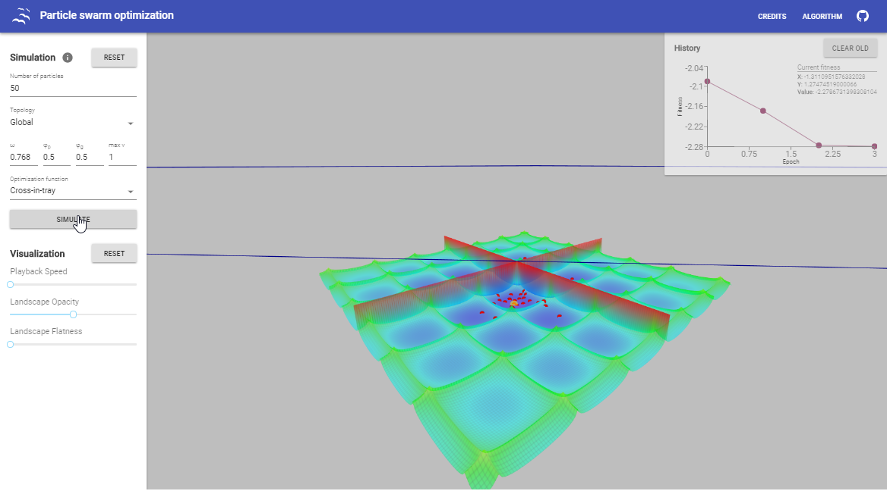

# PSOSIM
Particle Swarm Optimization algorithm's simulation, done as a project for course MTAT.03.238 Advanced Algorithmics (fall 2017).

## Live Demo

Live demo of the project can be found here: [Live Demo](https://abercus.github.io/PSOSIM/)

